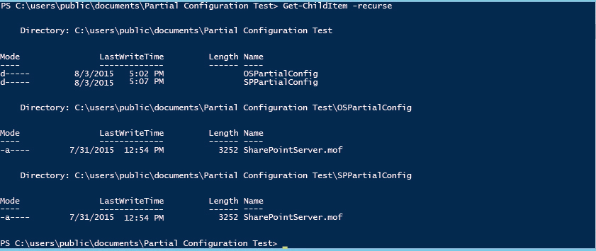
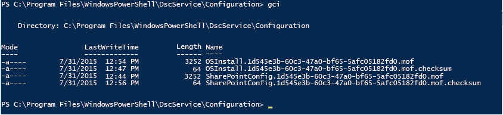

# Configurations partielles du service de configuration d’état souhaité PowerShell

>S’applique à : Windows PowerShell 5.0

Dans PowerShell 5.0, la configuration d’état souhaité (DSC) permet de distribuer des fragments de configuration provenant de plusieurs sources. Le gestionnaire de configuration local sur le nœud cible réunit les fragments avant de les appliquer sous forme de configuration unique. Cette fonctionnalité permet de partager le contrôle de la configuration entre plusieurs personnes ou équipes. Par exemple, si deux équipes ou plus de développeurs collaborent sur un service, elles peuvent avoir besoin de créer des configurations propres pour gérer leur partie du service. Chacune de ces configurations peut être extraite de différents serveurs collecteurs et ajoutée à différents stades de développement. Les configurations partielles permettent également à différents utilisateurs ou équipes de contrôler les divers aspects de la configuration des nœuds sans avoir à coordonner la modification d’un document de configuration unique. Par exemple, une équipe peut être chargée de déployer une machine virtuelle et un système d’exploitation, tandis qu’une autre peut déployer d’autres applications et services sur cette machine virtuelle. Avec les configurations partielles, chaque équipe peut créer sa propre configuration, sans qu’elle soit inutilement compliquée.

Vous pouvez utiliser des configurations partielles en mode par envoi ou par extraction, ou les deux.

## Configurations partielles en mode par envoi
Pour utiliser des configurations partielles en mode par envoi, vous configurez le gestionnaire de configuration local sur le nœud cible de façon à recevoir les configurations partielles. Chaque configuration partielle doit être envoyée à la cible à l’aide de l’applet de commande Publish-DSCConfiguration. Le nœud cible combine ensuite la configuration partielle en une configuration unique, que vous pouvez appliquer en appelant l’applet de commande [Start-DscConfiguration](https://technet.microsoft.com/en-us/library/dn521623.aspx).

### Configuration du gestionnaire de configuration local pour les configurations partielles en mode par envoi
Pour configurer le gestionnaire de configuration local pour les configurations partielles en mode par envoi, vous créez une configuration **DSCLocalConfigurationManager** avec un bloc **PartialConfiguration** pour chaque configuration partielle. Pour plus d’informations sur la configuration du gestionnaire de configuration local, consultez [Configuring the Local Configuration Manager](https://technet.microsoft.com/en-us/library/mt421188.aspx). L’exemple suivant montre une configuration de gestionnaire de configuration local avec deux configurations partielles : une qui déploie le système d’exploitation, et l’autre qui déploie et configure SharePoint.

```powershell
[DSCLocalConfigurationManager()]
configuration PartialConfigDemo
{
    Node localhost
    {
        
           PartialConfiguration OSInstall
        {
            Description = 'Configuration for the Base OS'
            RefreshMode = 'Push'
        }
           PartialConfiguration SharePointConfig
        {
            Description = 'Configuration for the SharePoint server'
            RefreshMode = 'Push'
        }
    }
}
PartialConfigDemo 
```

Le paramètre **RefreshMode** pour chaque configuration partielle est défini sur « Émission ». Les noms des blocs **PartialConfiguration** (dans ce cas, « OSInstall » et « SharePointConfig ») doivent correspondre exactement aux noms des configurations envoyées au nœud cible.

### Publication et démarrage de configurations partielles en mode par envoi


Vous appelez ensuite **Publish-DSCConfiguration** pour chaque configuration, en passant les dossiers contenant les documents de configuration comme paramètres Path. Après avoir publié les deux configurations, vous pouvez appeler `Start-DSCConfiguration –UseExisting` sur le nœud cible.

## Configurations partielles en mode par extraction

Les configurations partielles peuvent être extraites d’un ou plusieurs serveurs collecteurs (pour plus d’informations sur les serveurs collecteurs, consultez [Serveurs collecteurs de la configuration d’état souhaité Windows PowerShell](pullServer.md). Pour ce faire, vous devez configurer le gestionnaire de configuration local sur le nœud cible de façon à extraire les configurations partielles, et nommer et localiser correctement les documents de configuration sur les serveurs collecteurs.

### Configuration du gestionnaire de configuration local pour les configurations en mode par extraction

Pour configurer le gestionnaire de configuration local de façon à extraire les configurations partielles d’un serveur collecteur, vous définissez le serveur collecteur dans un bloc **ConfigurationRepositoryWeb** (pour un serveur collecteur HTTP) ou **ConfigurationRepositoryShare** (pour un serveur collecteur SMB). Vous créez ensuite des blocs **PartialConfiguration** qui font référence au serveur collecteur à l’aide de la propriété **ConfigurationSource**. Vous devez également créer un bloc de paramètres pour spécifier que le gestionnaire de configuration local utilise le mode par extraction et pour indiquer l’ID de configuration utilisé par le serveur collecteur et le nœud cible pour identifier les configurations. La métaconfiguration suivante définit un serveur collecteur HTTP nommé CONTOSO-PullSrv et deux configurations partielles qui l’utilisent.

```powershell
[DSCLocalConfigurationManager()]
configuration PartialConfigDemo
{
    Node localhost
    {
        Settings
        {
            RefreshMode = 'Pull'
            ConfigurationID = '1d545e3b-60c3-47a0-bf65-5afc05182fd0'
            RefreshFrequencyMins = 30 
            RebootNodeIfNeeded = $true
        }
        ConfigurationRepositoryWeb CONTOSO-PullSrv
        {
            ServerURL = 'https://CONTOSO-PullSrv:8080/PSDSCPullServer.svc'
            
        }
        
           PartialConfiguration OSInstall
        {
            Description = 'Configuration for the Base OS'
            ConfigurationSource = '[ConfigurationRepositoryWeb]CONTOSO-PullSrv'
            RefreshMode = 'Pull'
        }
           PartialConfiguration SharePointConfig
        {
            Description = 'Configuration for the Sharepoint Server'
            ConfigurationSource = '[ConfigurationRepositoryWeb]CONTOSO-PullSrv'
            DependsOn = '[PartialConfiguration]OSInstall'
            RefreshMode = 'Pull'
        }
    }
}
PartialConfigDemo 
```

Vous pouvez extraire des configurations partielles de plusieurs serveurs collecteurs, vous devez simplement définir chaque serveur collecteur, puis faire référence au serveur collecteur approprié dans chaque bloc PartialConfiguration.

Après avoir créé la métaconfiguration, vous devez l’exécuter pour créer un document de configuration (un fichier MOF), puis appeler [Set-DscLocalConfigurationManager](https://technet.microsoft.com/en-us/library/dn521621(v=wps.630).aspx) pour configurer le gestionnaire de configuration local.

### Attribution de noms et placement des documents de configuration sur le serveur collecteur

Les documents de configuration partielle doivent être placés dans le dossier spécifié comme **ConfigurationPath** dans le fichier `web.config` pour le serveur collecteur (généralement `C:\Program Files\WindowsPowerShell\DscService\Configuration`). Les documents de configuration doivent être nommés comme suit : _ConfigurationName_, _ConfigurationID_`.mof`, où _ConfigurationName_ est le nom de la configuration partielle et _ConfigurationID_ est l’ID de configuration défini dans le gestionnaire de configuration local sur le nœud cible. Dans notre exemple, les documents de configuration doivent être nommés comme suit.


### Exécution des configurations partielles d’un serveur collecteur

Une fois que le gestionnaire de configuration local a été configuré sur le nœud cible et que les documents de configuration ont été créés et correctement nommés sur le serveur collecteur, le nœud cible extrait les configurations partielles, les combine et applique la configuration obtenue à intervalles réguliers, comme spécifié par la propriété **RefreshFrequencyMins** du gestionnaire de configuration local. Si vous voulez forcer une actualisation, vous pouvez appeler l’applet de commande Update-DscConfiguration pour extraire les configurations, puis `Start-DSCConfiguration –UseExisting` pour les appliquer.

## Configurations partielles en modes par envoi et par extraction

Vous pouvez également associer les modes par envoi et par extraction pour les configurations partielles. Autrement dit, vous pouvez avoir une configuration partielle extraite d’un serveur collecteur et une autre envoyée. Traitez chaque configuration partielle selon son mode d’actualisation, comme décrit dans les sections précédentes. Par exemple, la métaconfiguration suivante décrit le même scénario, avec la configuration partielle du système d’exploitation en mode par extraction et la configuration partielle de SharePoint en mode par envoi.

```powershell
[DSCLocalConfigurationManager()]
configuration PartialConfigDemo
{
    Node localhost
    {
        Settings
        {
            RefreshMode = 'Pull'
            ConfigurationID = '1d545e3b-60c3-47a0-bf65-5afc05182fd0'
            RefreshFrequencyMins = 30 
            RebootNodeIfNeeded = $true
        }
        ConfigurationRepositoryWeb CONTOSO-PullSrv
        {
            ServerURL = 'https://CONTOSO-PullSrv:8080/PSDSCPullServer.svc'
            
        }
        
           PartialConfiguration OSInstall
        {
            Description = 'Configuration for the Base OS'
            ConfigurationSource = '[ConfigurationRepositoryWeb]CONTOSO-PullSrv'
            RefreshMode = 'Pull'
        }
           PartialConfiguration SharePointConfig
        {
            Description = 'Configuration for the Sharepoint Server'
            DependsOn = '[PartialConfiguration]OSInstall'
            RefreshMode = 'Push'
        }
    }
}
PartialConfigDemo 
```

Notez que le paramètre **RefreshMode** spécifié dans le bloc de paramètres est « Collecte », mais que le paramètre **RefreshMode** de la configuration partielle OSInstall est « Émission ».

Vous nommez et localisez les documents de configuration comme décrit ci-dessus selon leurs modes d’actualisation respectifs. Vous appelez **Publish-DSCConfiguration** pour publier la configuration partielle SharePointInstall, et vous attendez que la configuration OSInstall soit extraite du serveur collecteur ou vous forcez une actualisation en appelant [Update-DscConfiguration](https://technet.microsoft.com/en-us/library/mt143541(v=wps.630).aspx).

##Voir aussi 

**Concepts**
[Serveurs collecteurs de la configuration d’état souhaité Windows PowerShell](pullServer.md) 
[Configuration du gestionnaire de configuration local](https://technet.microsoft.com/en-us/library/mt421188.aspx) 


<!--HONumber=Apr16_HO2-->


