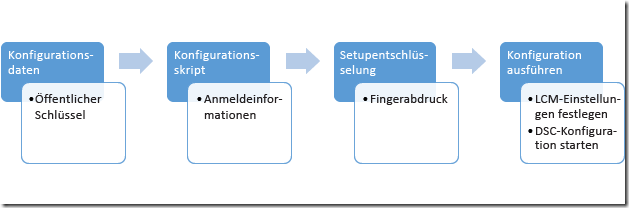

# Sécurisation du fichier MOF

>S’applique à : Windows PowerShell 4.0, Windows PowerShell 5.0

DSC indique aux nœuds cibles la configuration qu’ils doivent avoir en envoyant à chacun d’eux un fichier MOF contenant ces informations, dans lequel le gestionnaire de configuration local (LCM) implémente la configuration souhaitée. 
  Étant donné que ce fichier contient les détails de la configuration, il est important qu’il soit sécurisé. Pour ce faire, vous pouvez paramétrer le LCM pour qu’il vérifie les informations d’identification 
d’un utilisateur. Cette rubrique décrit comment transmettre ces informations d’identification en toute sécurité au nœud cible en les chiffrant avec des certificats.

>**Remarque :** cette rubrique présente les certificats utilisés pour le chiffrement. Pour le chiffrement, un certificat auto-signé est suffisant, car la clé privée est toujours gardée secrète et le chiffrement n’implique pas d’approbation du document. Les certificats auto-signés
>ne doivent *pas* être utilisés à des fins d’authentification. Pour l’authentification, vous devez utiliser un certificat d’une Autorité de certification (CA) approuvée.

## Conditions préalables

Afin de chiffrer correctement les informations d’identification utilisées pour sécuriser une configuration DSC, assurez-vous d’avoir les éléments suivants :

* **Un moyen d’émettre et de distribuer des certificats**. Cette rubrique et ses exemples supposent que vous utilisez une autorité de certification Active Directory. Pour plus d’informations sur les 
services de certificats Active Directory, voir [Vue d’ensemble des services de certificats Active Directory](https://technet.microsoft.com/library/hh831740.aspx) et 
[Services de certificat Active Directory dans Windows Server 2008](https://technet.microsoft.com/windowsserver/dd448615.aspx).
* **Un accès d’administrateur à un ou plusieurs nœuds cibles**.
* **Chaque nœud cible dispose d’un certificat de chiffrement compatible enregistré dans son magasin personnel**. Dans Windows PowerShell, le chemin du magasin est Cert:\LocalMachine\My. Les exemples de cette rubrique utilisent le 
modèle « Authentification de station de travail », disponible (ainsi que d’autres modèles de certificat) dans la page [Modèles de certificat par défaut](https://technet.microsoft.com/library/cc740061(v=WS.10).aspx).
* Si vous comptez exécuter cette configuration sur un ordinateur autre que le nœud cible, **exportez la clé publique du certificat**, puis importez-la sur l’ordinateur à partir duquel vous allez exécuter 
la configuration. Assurez-vous d’exporter uniquement la clé **publique** et sécurisez la clé privée.

## Processus général

 1. Configurez les certificats, les clés et les empreintes numériques en vous assurant que chaque nœud cible possède des copies du certificat et que l’ordinateur de configuration possède l’empreinte numérique et la clé publique.
 2. Créez un bloc de données de configuration qui contient le chemin et l’empreinte numérique de la clé publique.
 3. Créez un script de configuration qui définit votre configuration souhaitée pour le nœud cible et configure le déchiffrement sur les nœuds cibles en ordonnant au gestionnaire de configuration local de déchiffrer les données de configuration à l’aide du certificat et de son empreinte numérique.
 4. Exécutez la configuration qui définit les paramètres du gestionnaire de configuration local et lancez la configuration DSC.



## Exigences de certificat

Pour activer le chiffrement des informations d’identification, un certificat de clé publique doit être disponible sur le _nœud cible_, qui est **approuvé** par l’ordinateur utilisé pour créer la configuration DSC.
Pour pouvoir être utilisé, ce certificat de clé publique doit répondre à des exigences spécifiques pour le chiffrement des informations d’identification DSC :
 1. **Utilisation de la clé** :
   - Doit contenir : « KeyEncipherment » et « DataEncipherment ».
   - Ne doit _pas_ contenir : « Digital Signature ».
 2. **Utilisation améliorée de la clé** :
   - Doit contenir : chiffrement de document (1.3.6.1.4.1.311.80.1).
   - Ne doit _pas_ contenir : Client Authentication (1.3.6.1.5.5.7.3.2) et Server Authentication (1.3.6.1.5.5.7.3.1).
 3. La clé privée du certificat est disponible sur le *Nœud cible_.
 4. Le **fournisseur** pour le certificat doit être « Fournisseur de services de chiffrement Microsoft RSA SChannel ».
 
>**Meilleure pratique recommandée :** bien que vous puissiez utiliser un certificat contenant une utilisation de clé de type « Digital Signature » ou une authentification d’utilisation améliorée de la clé, la clé de chiffrement 
>est plus facilement utilisée à mauvais escient et vulnérable aux attaques. Par conséquent, il est recommandé d’utiliser un certificat créé spécifiquement pour les besoins de sécurisation des informations d’identification DSC, qui omet ces paramètres d’Utilisation de la clé et 
>d’Utilisation améliorée de la clé.
  
Tous les certificats existants sur le _Nœud cible_ qui répondent à ces critères peuvent être utilisés pour sécuriser les informations d’identification DSC.
 
## Création du certificat

La clé privée doit être gardée secrète, car elle est utilisée pour déchiffrer le fichier MOF. Le moyen le plus simple pour ce faire consiste à créer le certificat de clé privée sur le *Nœud cible*, puis à copier le certificat de clé publique 
sur l’ordinateur utilisé pour compiler la configuration DSC dans un fichier MOF. L’exemple suivant crée un certificat, exporte la clé publique, puis l’importe 
dans la racine du magasin de certificats local.

```powershell
# create the cert
$cert = New-SelfSignedCertificate -Type DocumentEncryptionCertLegacyCsp -DnsName 'DscEncryptionCert' 
# export the cert’s public key
$cert | Export-Certificate -FilePath "$env:temp\DscPublicKey.cer"  -Force                                                              
# import the cert’s public key as a trusted root certificate authority so that it is trusted
Import-Certificate -FilePath "$env:temp\DscPublicKey.cer" -CertStoreLocation Cert:\LocalMachine\Root > $null
```

Le certificat de clé privée peut également être créé sur l’ordinateur utilisé pour compiler le fichier de configuration DSC, exporté avec la clé privée, puis importé sur le _Nœud cible_. 
Il s’agit de la méthode actuelle pour implémenter le chiffrement des informations d’identification DSC sur Nano Server. La clé privée doit être sécurisée au cours du transit.

## Données de configuration

Le bloc de données de configuration définit les nœuds cibles concernés par l’opération, s’il faut ou non déchiffrer les informations d’identification, les moyens de chiffrement et d’autres informations. Pour plus d’informations sur le bloc de données de configuration, consultez [Séparation des données de configuration et d’environnement](configData.md).

Les éléments pouvant être configurés pour chaque nœud et qui sont liés au chiffrement des informations d’identification sont les suivants :
* **NodeName** : nom du nœud cible pour lequel le chiffrement des informations d’identification est configuré.
* **PsDscAllowPlainTextPassword** : indique si des informations d’identification non chiffrées peuvent être transmises à ce nœud. Cela **n’est pas recommandé**.
* **Thumbprint** : empreinte du certificat utilisée pour déchiffrer les informations d’identification dans la configuration DSC sur le _Nœud cible_. **Ce certificat doit exister dans le magasin de certificats de l’ordinateur local sur le nœud cible.**
* **CertificateFile** : fichier de certificat (contenant uniquement la clé publique) qui doit être utilisé pour chiffrer les informations d’identification pour le _Nœud cible_. Le fichier de certificat doit être au format X.509 binaire encodé DER ou X.509 encodé base 64.

Cet exemple montre un bloc de données de configuration qui spécifie le nœud cible concerné nommé targetNode, le chemin du fichier de certificat de clé publique (nommé targetNode.cer) et l’empreinte numérique de la clé publique.

```powershell
$ConfigData= @{ 
    AllNodes = @(     
            @{  
                # The name of the node we are describing 
                NodeName = "targetNode" 

                # The path to the .cer file containing the 
                # public key of the Encryption Certificate 
                # used to encrypt credentials for this node 
                CertificateFile = "C:\publicKeys\targetNode.cer" 

         
                # The thumbprint of the Encryption Certificate 
                # used to decrypt the credentials on target node 
                Thumbprint = "AC23EA3A9E291A75757A556D0B71CBBF8C4F6FD8" 
            }; 
        );    
    }
```

## Script de configuration

Dans le script de configuration lui-même, utilisez le paramètre `PsCredential` pour vous assurer que les informations d’identification sont stockées le moins longtemps possible. Quand vous exécutez l’exemple fourni, DSC vous invite à entrer des informations d’identification, puis chiffre le fichier MOF à l’aide du fichier de certificat associé au nœud cible dans le bloc de données de configuration. Cet exemple de code copie un fichier d’un partage sécurisé vers un utilisateur.

```
configuration CredentialEncryptionExample 
{ 
    param( 
        [Parameter(Mandatory=$true)] 
        [ValidateNotNullorEmpty()] 
        [PsCredential] $credential 
        ) 
    

    Node $AllNodes.NodeName 
    { 
        File exampleFile 
        { 
            SourcePath = "\\Server\share\path\file.ext" 
            DestinationPath = "C:\destinationPath" 
            Credential = $credential 
        } 
    } 
}
```

## Configuration du déchiffrement

Pour que [`Start-DscConfiguration`](https://technet.microsoft.com/en-us/library/dn521623.aspx) puisse fonctionner, vous devez indiquer au gestionnaire de configuration local sur chaque nœud cible le certificat à utiliser pour déchiffrer les informations d’identification, en utilisant la ressource CertificateID pour vérifier l’empreinte du certificat. Cet exemple de fonction recherche le certificat local approprié (vous devez peut-être la personnaliser pour qu’elle recherche le certificat exact que vous souhaitez utiliser) :

```powershell
# Get the certificate that works for encryption 
function Get-LocalEncryptionCertificateThumbprint 
{ 
    (dir Cert:\LocalMachine\my) | %{
        # Verify the certificate is for Encryption and valid 
        if ($_.PrivateKey.KeyExchangeAlgorithm -and $_.Verify()) 
        { 
            return $_.Thumbprint 
        } 
    } 
}
```

Une fois le certificat identifié par son empreinte numérique, le script de configuration peut être mis à jour pour utiliser la valeur suivante :

```powershell
configuration CredentialEncryptionExample 
{ 
    param( 
        [Parameter(Mandatory=$true)] 
        [ValidateNotNullorEmpty()] 
        [PsCredential] $credential 
        ) 
    

    Node $AllNodes.NodeName 
    { 
        File exampleFile 
        { 
            SourcePath = "\\Server\share\path\file.ext" 
            DestinationPath = "C:\destinationPath" 
            Credential = $credential 
        } 
        
        LocalConfigurationManager 
        { 
             CertificateId = $node.Thumbprint 
        } 
    } 
}
```

## Exécution de la configuration

À ce stade, vous pouvez exécuter la configuration qui produira deux fichiers :

 * Un fichier *.meta.mof qui configure le gestionnaire de configuration local de façon à déchiffrer les informations d’identification à l’aide du certificat stocké dans le magasin de l’ordinateur local et identifié par son empreinte numérique. [`Set-DscLocalConfigurationManager`](https://technet.microsoft.com/en-us/library/dn521621.aspx) applique le fichier *.meta.mof.
 * Un fichier MOF qui applique la configuration. Start-DscConfiguration applique la configuration.

Ces commandes accomplissent les étapes suivantes :

```powershell
Write-Host "Generate DSC Configuration..."
CredentialEncryptionExample -ConfigurationData $ConfigData -OutputPath .\CredentialEncryptionExample

Write-Host "Setting up LCM to decrypt credentials..."
Set-DscLocalConfigurationManager .\CredentialEncryptionExample -Verbose 
 
Write-Host "Starting Configuration..."
Start-DscConfiguration .\CredentialEncryptionExample -wait -Verbose
```

Cet exemple transmet la configuration DSC au nœud cible.
La configuration DSC peut également être appliquée à l’aide d’un serveur collecteur DSC, le cas échéant.

Pour plus d’informations sur l’application des configurations DSC à l’aide d’un serveur collecteur DSC, voir [cette page](PullClient.md).

## Exemple de module de chiffrement d’informations d’identification

Voici un exemple complet qui incorpore toutes ces étapes, ainsi qu’une applet de commande d’assistance qui exporte et copie les clés publiques :

```powershell
# A simple example of using credentials
configuration CredentialEncryptionExample
{
    param(
        [Parameter(Mandatory=$true)]
        [ValidateNotNullorEmpty()]
        [PsCredential] $credential
        )
    

    Node $AllNodes.NodeName
    {
        File exampleFile
        {
            SourcePath = "\\server\share\file.txt"
            DestinationPath = "C:\Users\user"
            Credential = $credential
        }
        
        LocalConfigurationManager
        {
            CertificateId = $node.Thumbprint
        }
    }
}

# A Helper to invoke the configuration, with the correct public key 
# To encrypt the configuration credentials
function Start-CredentialEncryptionExample
{
    [CmdletBinding()]
    param ($computerName)


    [string] $thumbprint = Get-EncryptionCertificate -computerName $computerName -Verbose
    Write-Verbose "using cert: $thumbprint"

    $certificatePath = join-path -Path "$env:SystemDrive\$script:publicKeyFolder" -childPath "$computername.EncryptionCertificate.cer"         

    $ConfigData=    @{
        AllNodes = @(     
                        @{  
                            # The name of the node we are describing
                            NodeName = "$computerName"

                            # The path to the .cer file containing the
                            # public key of the Encryption Certificate
                            CertificateFile = "$certificatePath"

                            # The thumbprint of the Encryption Certificate
                            # used to decrypt the credentials
                            Thumbprint = $thumbprint
                        };
                    );    
    }

    Write-Verbose "Generate DSC Configuration..."
    CredentialEncryptionExample -ConfigurationData $ConfigData -OutputPath .\CredentialEncryptionExample `
        -credential (Get-Credential -UserName "$env:USERDOMAIN\$env:USERNAME" -Message "Enter credentials for configuration") 

    Write-Verbose "Setting up LCM to decrypt credentials..."
    Set-DscLocalConfigurationManager .\CredentialEncryptionExample -Verbose 

    Write-Verbose "Starting Configuration..."
    Start-DscConfiguration .\CredentialEncryptionExample -wait -Verbose

}


#region HelperFunctions

# The folder name for the exported public keys
$script:publicKeyFolder = "publicKeys"

# Get the certificate that works for encryptions
function Get-EncryptionCertificate
{
    [CmdletBinding()]
    param ($computerName)
    $returnValue= Invoke-Command -ComputerName $computerName -ScriptBlock {
            $certificates = dir Cert:\LocalMachine\my

            $certificates | %{
                    # Verify the certificate is for Encryption and valid
                    if ($_.PrivateKey.KeyExchangeAlgorithm -and $_.Verify())
                    {
                        # Create the folder to hold the exported public key
                        $folder= Join-Path -Path $env:SystemDrive\ -ChildPath $using:publicKeyFolder
                        if (! (Test-Path $folder))
                        {
                            md $folder | Out-Null
                        }

                        # Export the public key to a well known location
                        $certPath = Export-Certificate -Cert $_ -FilePath (Join-Path -path $folder -childPath "EncryptionCertificate.cer") 

                        # Return the thumbprint, and exported certificate path
                        return @($_.Thumbprint,$certPath);
                    }
                  }
        }
    Write-Verbose "Identified and exported cert..."
    # Copy the exported certificate locally
    $destinationPath = join-path -Path "$env:SystemDrive\$script:publicKeyFolder" -childPath "$computername.EncryptionCertificate.cer"
    Copy-Item -Path (join-path -path \\$computername -childPath $returnValue[1].FullName.Replace(":","$"))  $destinationPath | Out-Null

    # Return the thumbprint
    return $returnValue[0]
}

Start-CredentialEncryptionExample
```


<!--HONumber=Mar16_HO5-->


