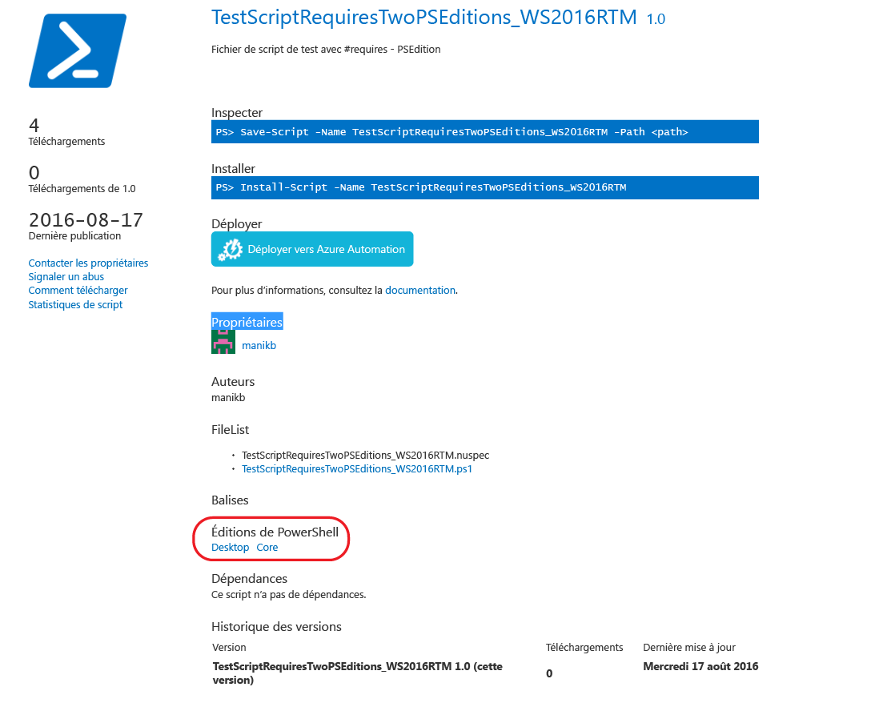
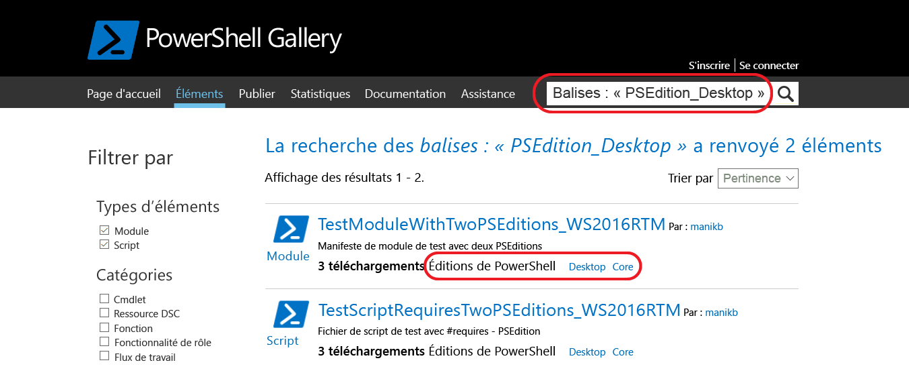

# Éléments avec des éditions PowerShell compatibles

À compter de la version 5.1, PowerShell est disponible dans différentes éditions qui indiquent la compatibilité de la plateforme et les différents ensembles de fonctionnalités.

- **Desktop Edition :** basée sur le .NET Framework, elle fournit la compatibilité avec les scripts et les modules qui ciblent des versions de PowerShell exécutées sur des éditions complètes de Windows telles que Server Core et Windows Desktop.
- **Core Edition :** basée sur .NET Core, elle fournit la compatibilité avec les scripts et les modules qui ciblent des versions de PowerShell exécutées sur des éditions réduites de Windows telles que Nano Server et Windows IoT.

## PowerShell Gallery extrait des métadonnées d’éditions PS prises en charge et vous permet de filtrer les éléments compatibles pour des éditions PowerShell spécifiques

Si des éditions PS compatibles sont spécifiées pour un élément, elles sont répertoriées dans le cadre des « Éditions PowerShell » dans la page d’affichage de l’élément et également dans les résultats des éléments.

## Rechercher des éléments dans l’interface utilisateur PowerShell Gallery qui fonctionnent sur PowerShellCore

Utiliser Tags:"PSEdition_Desktop" et Tags:"PSEdition_Core" pour filtrer les éléments sur PowerShell Gallery.

### Utiliser Tags:"PSEdition_Core" pour rechercher les éléments compatibles avec l’édition PowerShell Core.

### Utiliser Tags:"PSEdition_Desktop" pour rechercher les éléments compatibles avec l’édition PowerShell Desktop.

## Plus d’informations sur la création et la recherche des éléments avec des éditions PowerShell compatibles

- [Modules avec des éditions PS](../../concepts/module-psedition-support.md)
- [Scripts avec des éditions PS](../../concepts/script-psedition-support.md)