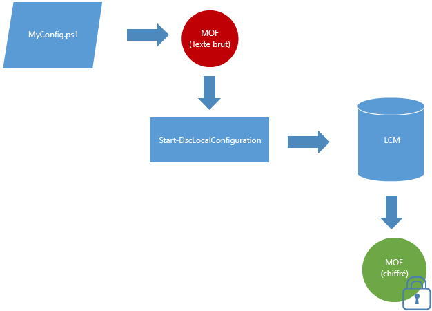

# Les documents MOF sont chiffrés par défaut

Les documents de configuration contiennent des informations sensibles. Dans les versions précédentes de DSC, vous deviez distribuer et gérer des certificats pour sécuriser les informations d’identification dans une configuration. Pour de nombreux utilisateurs il s’agissait d’une charge de travail élevée, et même avec tout le travail effectué, certaines informations de configuration n’était pas et ne pouvaient pas être sécurisées. 

Ce n’est plus le cas, car **tous les documents MOF de configuration sont sécurisés par défaut**. Aucun certificat ou paramètre de métaconfiguration n’est nécessaire. Quand un document MOF de configuration est enregistré sur le disque par le gestionnaire de configuration local sur un nœud cible, il est chiffré. Les documents MOF sont chiffrés à l’aide de [DPAPI](https://msdn.microsoft.com/en-us/library/ms995355.aspx). **Remarque :** Les documents MOF générés par un script de configuration ne sont pas chiffrés.

**Exemple :** Chiffrement en mode push 

Si vous utilisez déjà la méthode par certificat pour le chiffrement des mots de passe ou si vous avez besoin d’une sécurité supplémentaire pour vos mots de passe, la [méthode de chiffrement par certificat existante](https://msdn.microsoft.com/en-us/powershell/dsc/securemof) continuera à fonctionner. Le résultat sera un document MOF entièrement chiffré à l’aide des DPAPI et qui intégrera des mots de passe chiffrés.

Ce chiffrement s’applique uniquement aux documents MOF de configuration (pending.mof, current.mof, previous.mof et fichiers MOF partiels). Les documents MOF de métaconfiguration sont toujours enregistrés en texte brut, car il est moins probable qu’ils contiennent des données confidentielles.

<!--HONumber=Jul16_HO1-->

