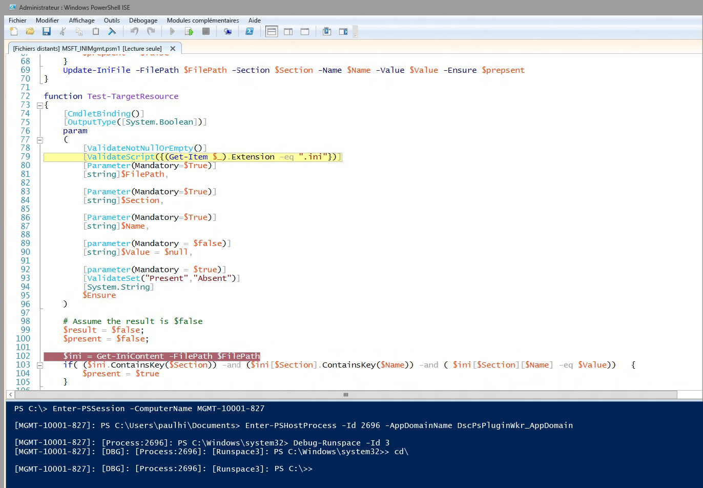

# Débogage de script de ressources DSC
WMF 5.0 Production Preview inclut la prise en charge du débogage des scripts de ressources DSC pendant qu’ils s’exécutent sur des nœuds cibles. Dans les versions antérieures de WMF 5.0, nous avons ajouté des fonctionnalités de débogage de script avancées permettant d’établir une jonction à des processus locaux (Get-PSHostProcessInfo, Enter-PSHostProcessInfo, Exit-PSHostProcessInfo), d’énumérer toutes les instances d’exécution dans un processus et de déboguer une instance d’exécution arbitraire dans un processus (Get-Runspace, Debug-Runspace).

Le débogage de script de ressources DSC s’appuie sur ce travail en ajoutant deux nouvelles applets de commande.

##Syntaxe
**Enable-DscDebug**
Enable-DscDebug \[-BreakAll\] \[-CimSession &lt;CimSession\[\]&gt;\] \[-ThrottleLimit &lt;int&gt;\] \[-AsJob\] \[-WhatIf\] \[-Confirm\] \[&lt;paramètres_courants&gt;\]

**Disable-DscDebug**
Disable-DscDebug \[-CimSession &lt;CimSession\[\]&gt;\] \[-ThrottleLimit &lt;int&gt;\] \[-AsJob\] \[-WhatIf\] \[-Confirm\] \[&lt;paramètres_courants&gt;\]

##Flux de travail ordinaire


```PowerShell
PS C:\Test> Enable-DscDebug –BreakAll

PS C:\Test> Start-DscConfiguration -path .\TestConfig2 -Wait -Verbose
VERBOSE: Perform operation 'Invoke CimMethod' with following parameters, ''namespaceName' = root/Microsoft/Windows/DesiredStateConfiguration,'className' = MSFT\_DSCLocalConfigurationManager,'methodName' = SendConfigurationApply'.
VERBOSE: An LCM method call arrived from computer MGMT-10001-827 with user sid S-1-5-21-397955417-626881126-188441444-3860663.
VERBOSE: [MGMT-10001-827]: LCM: [ Start Set ]
WARNING: [MGMT-10001-827]: [DSCEngine] Warning LCM is in Debug 'ResourceScriptBreakAll' mode. Resource script processing will be stopped to wait for PowerShell script debugger to attach.
VERBOSE: [MGMT-10001-827]: [DSCEngine] Importing the module C:\WINDOWS\system32\WindowsPowerShell\v1.0\Modules\PSDesiredStateConfiguration\DscResources\MSFT_EnvironmentResource\MSFT_EnvironmentResource.psm1 in force mode.
VERBOSE: [MGMT-10001-827]: LCM: [ Start Resource ] [[Environment]e1]
VERBOSE: [MGMT-10001-827]: LCM: [ Start Test ] [[Environment]e1]
VERBOSE: [MGMT-10001-827]: [[Environment]e1] Importing the module MSFT_EnvironmentResource in force mode.
WARNING: [MGMT-10001-827]: [[Environment]e1] Resource is waiting for PowerShell script debugger to attach. Use the following commands to begin debugging this resource script:
Enter-PSSession -ComputerName MGMT-10001-827 -Credential <credentials>
Enter-PSHostProcess -Id 2640 -AppDomainName DscPsPluginWkr_AppDomain
Debug-Runspace -Id 3

PS C:\Test> Disable-DscDebug
```
Examinons chacune de ces commandes et ce qu’elles font :

**Enable-DscDebug –BreakAll**
L’applet de commande Enable-DscDebug avec BreakAll configure le gestionnaire de configuration local DSC pour exécuter des scripts Get-TargetResource, Set-TargetResource, et Test-TargetResource en mode Interrompre tout. Cela signifie que le script s’arrête à la première instruction de script et qu’il attend qu’un débogueur soit attaché. Vous pouvez ensuite vous connecter à l’ordinateur cible à l’aide de l’accès distant Windows PowerShell et attacher le débogueur Windows PowerShell au processus et à l’instance d’exécution du gestionnaire de configuration local pour déboguer le script. Après cela, vous pouvez définir des points d’arrêt et déboguer le script normalement dans Windows PowerShell.

**Start-DscConfiguration -path .\TestConfig2 -Wait -Verbose**

Ceci lance DSC, mais comme indiqué précédemment, étant donné que le nœud cible est en mode débogage, il s’arrêtera à la première ressource DSC exécutée par le gestionnaire de configuration local.

Pour commencer la session de débogage, exécutez les commandes affichées dans le message d’avertissement après avoir exécuté Start-DscConfiguration, puis attachez votre débogueur de script Windows PowerShell client à l’ordinateur, au processus, au domaine d’application et à l’instance d’exécution appropriés.

* Exécutez cette commande pour utiliser éventuellement l’accès distant Windows PowerShell pour vous connecter à l’ordinateur cible. Ignorez cette étape si vous disposez déjà d’une connexion Bureau à distance.
```PowerShell
Enter-PSSession -ComputerName MGMT-10001-827
```
* Cette commande établit une jonction au domaine d’application et au processus hôte DSC du gestionnaire de configuration local où s’exécute le script de ressources.
```PowerShell
Enter-PSHostProcess -Id 2640 -AppDomainName DscPsPluginWkr\_AppDomain
```
*  Cette dernière commande vous permet de déboguer l’instance d’exécution DSC qui exécute le script.
```PowerShell
Debug-Runspace -Id 3
```


Une fois le débogueur attaché, définissez des points d’arrêt de ligne où vous souhaitez examiner l’exécution du script, et exécutez la commande du débogueur **continue** pour exécuter le script dans le débogueur. Une fois le débogage terminé, vous pouvez arrêter l’exécution du script en tapant la commande du débogueur **quit**, ou laisser le script continuer à s’exécuter sans le débogueur en exécutant la commande du débogueur **detach**.

Notez que ***tous*** les scripts de ressources sont arrêtés dans le débogueur. Cela signifie que les scripts Test-TargetResoruce, Set-TargetResource et Get-TargetResource s’arrêtent chacun leur tour dans le débogueur. Si vous ne souhaitez pas déboguer un script de ressources, vous pouvez quitter le mode débogage dans l’instance d’exécution en exécutant cette commande :

Disable-RunspaceDebug -RunspaceId 3

Ou vous pouvez attacher le débogueur en exécutant Debug-Runspace, puis exécuter immédiatement la commande **detach**.

Une fois que vous avez terminé de déboguer votre script de ressources, vous devez arrêter la configuration DSC en exécutant la commande suivante :

Stop-DscConfiguration –Force

Pour finir, vous devez reconfigurer le gestionnaire de configuration local de l’ordinateur cible pour désactiver le mode débogage à l’aide de l’applet de commande Disable-DscDebug.<!--HONumber=Mar16_HO2-->
